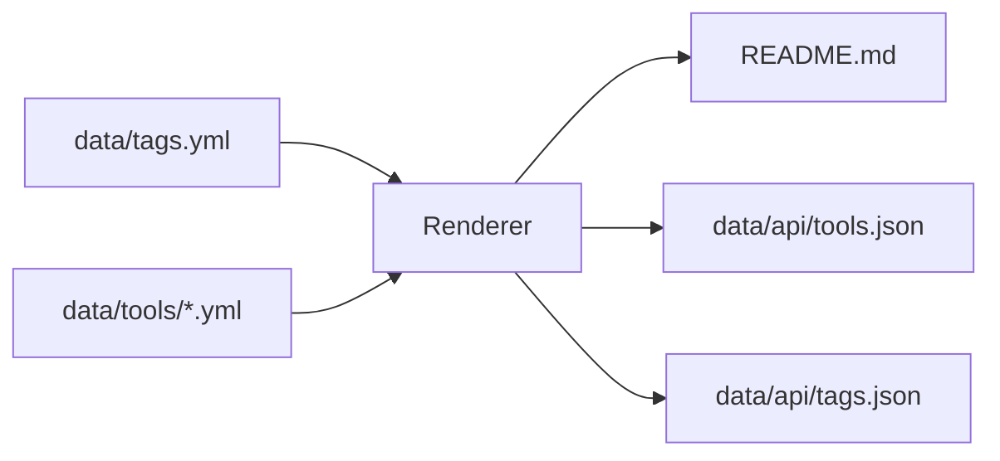
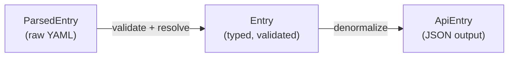

The renderer is a Rust binary located in `ci/render/`. It is the single source of truth for both the human-readable `README.md` and the machine-readable `data/api/` output. Every time you run `make render`, this program reads all YAML tool definitions, validates them, and writes both outputs atomically.

## What the renderer does



1. **Load tags** — reads `data/tags.yml` to build the authoritative list of valid tag values.
2. **Parse tool YAML** — reads every `.yml` file under `data/tools/` into `ParsedEntry` structs.
3. **Validate** — runs lint checks on each `ParsedEntry` (see [validation rules](#validation-rules) below).
4. **Resolve tags** — converts raw tag strings (e.g. `"python"`) to full `Tag` structs, failing if any string is not in `tags.yml`.
5. **Build catalog** — groups entries by tag into an `EntryMap`, separating multi-language tools into their own section.
6. **Render README** — passes the `Catalog` struct to an Askama template that produces `README.md`.
7. **Build API** — converts the `Catalog` into a flat `BTreeMap<String, ApiEntry>` and serializes it to `data/api/tools.json`.

## Make targets

Run these from the repository root:

| Command | Description |
|---------|-------------|
| `make render` | Full render including deprecated tools. |
| `make render-skip-deprecated` | Render without deprecated tools — useful during development. |
| `make check` | Run `cargo check` to verify the code compiles. |
| `make clippy` | Run `cargo clippy -- -D warnings` to catch lint issues in the Rust code. |
| `make test` | Run the test suite. |
| `make fmt` | Format all Rust source files with `rustfmt`. |
| `make clean` | Remove build artifacts. |

### Full render command

`make render` executes:

```bash
cargo run --manifest-path ci/Cargo.toml -p render -- \
  --tags data/tags.yml \
  --tools data/tools \
  --md-out README.md \
  --json-out data/api
```

Adding `--skip-deprecated` omits any tool whose `deprecated` field is `true`:

```bash
cargo run --manifest-path ci/Cargo.toml -p render -- \
  --tags data/tags.yml \
  --tools data/tools \
  --md-out README.md \
  --json-out data/api \
  --skip-deprecated
```

## Validation rules

Before a tool entry is written to any output, the renderer runs it through a linter defined in `ci/render/src/lints.rs`. The currently enforced rules are:

### Name length

```rust
pub fn name(entry: &ParsedEntry, _: &[Tag]) -> Result<()> {
    if entry.name.len() <= 50 {
        Ok(())
    } else {
        Err(anyhow!(
            "Name of entry may be at most 50 characters long, but {} is {} long",
            entry.name,
            entry.name.len()
        ))
    }
}
```

Tool names must be 50 characters or fewer. The renderer returns an error with the tool name and length if this is exceeded.

### At least one tag

```rust
pub fn min_one_tag(entry: &ParsedEntry, _: &[Tag]) -> Result<()> {
    if entry.tags.is_empty() {
        Err(anyhow!(
            "{} must have at least one tag from `tags.yml`.",
            entry.name
        ))
    } else {
        Ok(())
    }
}
```

Every tool must declare at least one tag. A tool with no tags is rejected with a clear error message.

### Tag existence

After the lint checks pass, the renderer resolves each tag string against the loaded `tags.yml`. If a tag value like `"mylangu"` does not appear in `tags.yml`, the renderer fails with:

```
Tool 'MyTool': Invalid tag: mylangu
  File: data/tools/mytool.yml
```

This ensures no tool can reference an undefined tag.

## Data types

The renderer uses three distinct types to represent a tool as it moves through the pipeline:

### `ParsedEntry`

The raw deserialized form of a `.yml` file. Tags are plain strings (`BTreeSet<String>`), types are plain strings, and all optional fields may be `None`.

### `Entry`

The validated, resolved form. Tags are full `Tag` structs (with `name`, `value`, and `tag_type`). Types are the `ToolType` enum (`cli`, `gui`, `service`, `ide-plugin`). This is the type used to build the `Catalog` for README rendering.

### `ApiEntry`

The de-normalized, serialization-friendly form written to `tools.json`. Languages and other tags are split into separate `Vec<String>` arrays. The license string is wrapped in a `Vec<String>` to anticipate future multi-license support. This is the type consumers of the JSON API interact with.



## Template system

`README.md` is generated using [Askama](https://github.com/djc/askama), a compile-time Jinja2-inspired templating library for Rust. The template lives at `ci/render/templates/README.md` and receives a `Catalog` struct containing:

- `linters` — tools grouped by language tag.
- `others` — tools grouped by "other" tag.
- `multi` — tools that support more than one programming language (except C/C++ which is treated as a single entry).

Because the template is compiled into the binary, any syntax error in the template causes a compile-time failure rather than a runtime panic.

## Workspace structure

The renderer is part of a Cargo workspace defined in `ci/Cargo.toml`:

```toml
[workspace]
members = [
    "render",
    "pr-check",
]
resolver = "2"
```

Key dependencies:

| Crate | Purpose |
|-------|---------|
| `askama` | Compile-time template rendering for README.md |
| `serde` / `serde_json` / `serde_yaml` | YAML parsing and JSON serialization |
| `anyhow` | Ergonomic error handling |
| `chrono` | Date handling for deprecation checks |
| `slug` | Tool name → URL-safe key conversion |
| `tokio` | Async runtime for GitHub API deprecation checks |

## Related pages

<CardGroup cols={2}>
  <Card title="Local development" icon="laptop" href="/api/local-development">
    How to set up the repository and run the renderer locally.
  </Card>
  <Card title="Tool schema" icon="code" href="/api/tool-schema">
    The JSON schema produced by the renderer for each tool.
  </Card>
  <Card title="Tool format" icon="file" href="/contributing/tool-format">
    The YAML format the renderer reads as input.
  </Card>
  <Card title="API overview" icon="database" href="/api/overview">
    How to query and use the generated JSON files.
  </Card>
</CardGroup>
